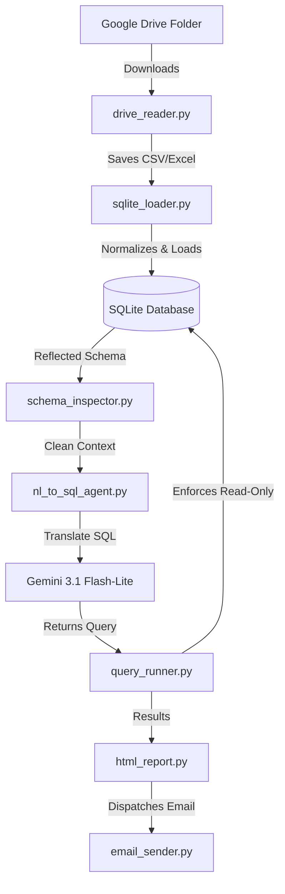

# 🤖 Enterprise AI Data Analysis Agent
### *Secure Google Drive to SQLite Synchronization, Self-Healing SQL Translator, and Visual BI Dashboard*

[](https://python.org)
[](https://sqlite.org)
[](https://ai.google.dev/)
[](https://google.com/drive)
[](https://streamlit.io)
[](#)
[](#)

---

## 🧭 Document Navigation
1.  [Overview](#2-project-overview)
2.  [Features Table](#3-features)
3.  [System Architecture](#4-high-level-architecture)
4.  [End-to-End sequence](#5-complete-end-to-end-workflow)
5.  [AI Query translation](#6-ai-workflow)
6.  [Project Directory Map](#7-complete-project-structure)
7.  [Module details](#8-module-documentation)
8.  [Data Flow Map](#9-data-flow)
9.  [Execution Guides](#10-execution-flow)
10. [AI Prompt Engineering](#11-ai-prompt-engineering)
11. [Security controls](#12-security-architecture)
12. [Error Resilience](#13-error-handling)
13. [Performance optimization](#14-performance-optimizations)
14. [Testing Suite](#15-testing)
15. [Installation steps](#16-installation)
16. [Configuration variables](#17-configuration)
17. [Troubleshooting Guide](#18-troubleshooting)
18. [Comprehensive FAQ](#19-faq)
19. [Glossary of Terms](#24-glossary-of-terms)

---

## 2. Project Overview
This project is a secure, automated data analytics tool. It automatically checks a Google Drive folder for spreadsheet updates, loads them into a local database, and lets you query the data in simple English. 

### Why It Exists
Business users often store logs and spreadsheets in shared directories. Getting answers from this data normally requires databases, writing SQL statements, or waiting for IT. This application automates this entire cycle securely.

### Business Value
*   **Zero SQL Code:** Translates simple English questions into database queries.
*   **Bandwidth Saver:** Only downloads changed spreadsheets.
*   **Security Focused:** Strict read-only database connections protect your data.
*   **Self-Healing AI:** Automatically detects and repairs SQL database query errors.

---

## 3. Features

| Component | What It Does | Business Value |
| :--- | :--- | :--- |
| **🔄 Sync Ingestion** | Syncs CSV/Excel spreadsheets from Google Drive. | Automates manual exports. |
| **⚡ Incremental Sync** | Checks modifications and downloads changed files. | Prevents redundant processing. |
| **🧼 Data Normalization**| Sanitizes column headers and blocks reserved words. | Prevents query failures. |
| **🧠 Text-to-SQL** | Translates questions to SQL queries via Gemini. | No SQL knowledge required. |
| **🛡️ Safety Shield** | Blocks command queries (e.g. `DROP`, `DELETE`). | Prevents SQL injections. |
| **🩹 SQL Healing** | Automatically corrects syntax issues (3 retries). | Robust runtime operation. |
| **📧 Reporting** | Creates reports and emails them via SMTP. | Automatic summary delivery. |
| **📊 UI Dashboard** | Interactive dashboard supporting dark/light mode. | Dynamic data visualization. |

---

## 4. High-Level Architecture

The components are modularized to isolate data ingestion, query translation, and presentation:



*   **drive_reader.py:** Service account authentication and folder downloads.
*   **sqlite_loader.py:** Memory-safe chunk parsing, column standardization, and quality metrics log checking.
*   **nl_to_sql_agent.py:** Gemini client generation, query validation, and repair cycles.
*   **query_runner.py:** Read-only SQLite query connection manager.

---

## 5. Complete End-to-End Workflow

The sequence below describes a full synchronization and question execution workflow:

```mermaid
sequenceDiagram
    autonumber
    actor User
    participant Streamlit as streamlit_app.py / main.py
    participant Sync as pipeline.py [Sync]
    participant Drive as drive_reader.py
    participant Loader as sqlite_loader.py
    participant DB as SQLite Engine
    participant Agent as nl_to_sql_agent.py
    participant Gemini as Gemini API
    participant SMTP as email_sender.py

    User->>Streamlit: Trigger execution or sync
    Streamlit->>Sync: Request synchronization check
    Sync->>Drive: List files in Folder ID
    Drive-->>Sync: Return active files metadata list
    Sync->>DB: Check _sync_metadata table
    DB-->>Sync: Return cache state records
    alt File Unchanged
        Sync->>Sync: Skip download
    else File Modified / New
        Sync->>Drive: Download file
        Drive-->>Sync: Saved locally
        Sync->>Loader: Ingest and validate file
        Loader->>DB: Replace/Create schema & insert rows
        Loader-->>Sync: Log quality metrics and warning logs
        Sync->>DB: Save sync metadata record
    end
    
    Streamlit->>Sync: Submit question list
    Sync->>Agent: Request SQL translation
    Agent->>DB: Read cached database schema
    Agent->>Gemini: Request SQL (Schema + Question)
    Gemini-->>Agent: Raw SQL query string
    Agent->>Agent: Run validation (keyword block, semicolons)
    
    loop Query Repair (Up to 3 Retries)
        Agent->>DB: Execute query via ReadOnlyQueryRunner
        alt Success
            DB-->>Agent: Results pandas Dataframe
        else Database Error
            DB-->>Agent: sqlite3.Error exception
            Agent->>Gemini: Request repaired SQL (Schema + Question + Query + Error)
            Gemini-->>Agent: Repaired SQL string
        end
    end
    
    Agent-->>Sync: Return final results datasets
    Sync->>Streamlit: Render tables and charts
    Sync->>SMTP: Send compiled HTML report
    SMTP-->>User: Delivery confirmation email
```



---

## 6. AI Workflow

```text
[User Question]
       │
       ▼
[Validate Question] ──(Blocks suspicious keywords and injection patterns)
       │
       ▼
[Build Context Prompt] ──(Inject Reflected Schema + System Rules)
       │
       ▼
[Gemini API Request] ──(Returns SQL Query)
       │
       ▼
[SQL Validation Shield] ──(Checks for SELECT/WITH, blocks comments and semicolons)
       │
       ▼
[Execution via ReadOnlyQueryRunner]
       │
       ├─(Success)───────────────────> [Return Results DataFrame]
       │
       └─(Fails: sqlite3.Error)
               │
               ▼
       [Self-Healing Loop] ──(Ask Gemini to fix query using error context, max 3x)
```

### 🧠 AI Agent Philosophy & Native Architecture (No Frameworks)
This project implements a custom AI agent entirely in native Python without relying on heavy frameworks like **LangChain** or **CrewAI**. This decision maximizes execution speed, reduces dependency bloat, and simplifies debugging.

#### Is this system API-driven or a Web Server?
*   **Direct Pipeline Execution:** The app does *not* open local REST APIs (e.g. FastAPI/Flask) to execute tasks. It runs directly as a Python script pipeline.
*   **External REST Clients:** It calls Google Drive REST endpoints (to query folder changes) and Google Gemini REST models (to translate questions to SQL queries).

#### Why is this considered "Agentic"?
An agent is a software pattern that observes its environment, takes an action, evaluates the output, and autonomously adjusts its plan to repair any failures. This agent accomplishes this using a native SQL repair loop.

#### Code Logic Example of the Self-Healing Loop:
```python
# Simplified snippet of the native agent loop in nl_to_sql_agent.py
attempts = 0
max_repairs = 3

while attempts < max_repairs:
    try:
        # Action: Attempt database query
        dataframe = runner.execute(sql)
        return sql, dataframe, attempts, None
    except sqlite3.Error as database_error:
        # Perception: Catch database syntax/schema failure
        attempts += 1
        
        # Correction Plan: Ask Gemini to repair query using error details
        repair_prompt = f"Previous SQL query failed: {sql}. Database Error: {database_error}."
        sql = call_gemini(repair_prompt)
```

---

## 7. Complete Project Structure

```text
gdrive_sqlite_agent/
├── .env.example              # Template containing default environment variables
├── config.py                 # System configuration parser and validation shield
├── drive_reader.py           # Google Drive API downloader with retry logic
├── email_sender.py           # SMTP client for sending HTML emails
├── html_report.py            # Responsive report builder optimized for email clients
├── main.py                   # Command-line entry point with health checks
├── nl_to_sql_agent.py        # Natural Language agent, query validation, and self-healing
├── pipeline.py               # Main pipeline manager orchestrating threads
├── prompts.py                # System and SQL repair prompts
├── query_runner.py           # Read-only SQLite connection runner
├── question_loader.py        # Questions loader utility
├── questions.txt             # Questions list processed by the CLI
├── requirements.txt          # Python package requirements file
├── schema_inspector.py       # Reflects database schemas and handles caching
├── sqlite_loader.py          # ETL parser with schema normalization and quality metrics
├── streamlit_app.py          # Interactive web UI dashboard
└── test_suite.py             # Unit/integration test suites
```

### File Responsibilities

*   `config.py`: Validates environment settings, directories, and file permissions before starting.
*   `drive_reader.py`: Authenticates with Google Drive and downloads spreadsheets.
*   `sqlite_loader.py`: Cleans column names, counts empty cells, and loads data into SQLite database tables.
*   `schema_inspector.py`: Inspects database tables and metadata, caching them to avoid redundant database hits.
*   `nl_to_sql_agent.py`: Interfaces with the Gemini API to translate questions, validate SQL queries, and manage repair loops.
*   `query_runner.py`: Enforces read-only permissions on SQLite query connections.
*   `pipeline.py`: Orchestrates synchronization, multithreaded SQL generation, and emails.
*   `html_report.py`: Compiles results tables and KPI summaries into visual report layouts.
*   `email_sender.py`: Dispatches HTML reports to recipients via SMTP.

---

## 8. Module Documentation

### `config.py`
Provides settings parsing and error checks. Features a validation method that verifies path write access, credentials formats, and SMTP App Password parameters.

### `drive_reader.py`
Interfaces with Google Drive API v3. Features exponential backoff handling to retry queries on rate limits (429) and transient errors (5xx).

### `sqlite_loader.py`
An ETL parser that supports Excel sheets and CSV parsing. Automatically resolves duplicate columns, counts null values, and detects mixed types. Uses chunked loading (chunks of 20,000 rows) to process large datasets safely.

### `schema_inspector.py`
Reflects database structures, column data types, constraints, and fetches sample rows. Features an automatic schema cache that invalidates if database file modification times (`mtime`) change.

### `nl_to_sql_agent.py`
Coordinates the query translation pipeline. Employs regex guards to sanitize questions and checks generated queries to verify they are read-only and contain no comments.

### `query_runner.py`
Sets up read-only query runner connections by specifying mode parameters in the database URI (`?mode=ro`) and executing `PRAGMA query_only = ON`.

### `pipeline.py`
Coordinates the application. Checks files catalog changes, drops deleted tables, and runs query translations concurrently using a ThreadPoolExecutor.

### `html_report.py`
Generates visual summaries. Built using standard HTML tables and explicit hex values to ensure layouts align correctly inside email clients like Gmail.

### `email_sender.py`
Establishes connection scopes with SMTP servers using SSL/TLS, and dispatches MIME emails containing reports.

### `streamlit_app.py`
Interactive web dashboard. Custom CSS custom variables adapt to dark and light dashboard themes dynamically.

---

## 9. Data Flow

```text
[Google Drive Source]
       │ (Download)
       ▼
[data/downloads/ CSV/XLSX]
       │ (pandas ETL Ingestion & Identifier Normalization)
       ▼
[sqlite_loader.py Ingestion] ──> [Quality Metrics Logs]
       │
       ▼
[data/agent_database.db] 
       │ (Cached Schema Reflection)
       ▼
[nl_to_sql_agent.py Translation] <── [Gemini 3.1 Flash-Lite Context]
       │ (Validation Check & Self-Healing Loop)
       ▼
[ReadOnlyQueryRunner Execution]
       │
       ▼
[pandas Results DataFrame] 
       │ (HTML Report Generation & SMTP Sending)
       ▼
[Email Inbox & st.iframe Preview]
```

---

## 10. Execution Flow

### Pipeline Execution via CLI (`python main.py`)
1.  **Validation:** Runs startup checks, stopping on missing settings.
2.  **Synchronization:** Queries Drive, compares modified times, updates database records, and drops deleted tables.
3.  **Translate SQL:** Reads batch questions, generates query strings, runs validation checks, and executes queries.
4.  **Reporting:** Compiles HTML report summaries and dispatches email notifications via SMTP.

### Pipeline Execution via Dashboard (`streamlit run streamlit_app.py`)
1.  Loads credentials and reflects database catalog schema details.
2.  Displays sync statuses, database sizes, and model parameters in the sidebar.
3.  Executes query translations in parallel and updates process step timelines.
4.  Renders formatted results tables, SQL boxes, and response times.
5.  Includes download and manual email dispatch controls.

---

## 11. AI Prompt Engineering

### `SQL_SYSTEM_PROMPT`
Instructs the AI to translate questions to SQL. It defines:
*   **Schema Alignment:** The AI is instructed not to assume or guess table columns or names.
*   **Division Safety:** Division operations are protected using `NULLIF` (e.g. `ROUND(a / NULLIF(b,0), 2)`).
*   **Aggregation Rules:** Round percentages, averages, and rates to 2 decimal places.

### `SQL_REPAIR_PROMPT`
Used when a query fails execution. It provides the failed SQL query and database error message, instructing the AI to correct the query.

---

## 12. Security Architecture

```text
[User Input Question]
       │
       ▼
[Question Validation] ──(Blocks instruction bypasses and injection words)
       │
       ▼
[Query Validation] ──(Rejects updates, comments, chained queries)
       │
       ▼
[ReadOnlyQueryRunner] ──(Connects with mode=ro and PRAGMA query_only=ON)
```

*   **Write Restriction:** Connections specify `mode=ro` and execute `PRAGMA query_only = ON` to block modification queries.
*   **Query Sanitation:** Rejects queries containing keywords like `DELETE`, `INSERT`, `DROP`, or chained statements.
*   **Injection Guards:** Sanitizes input questions to block developer mode override attempts.

---

## 13. Error Handling

*   **API Retries:** Google Drive and Gemini API requests are retried up to 4 times on rate limits (429) and transient errors (5xx).
*   **Self-Healing Loop:** Automatically repairs query syntax errors using the database error context.
*   **Email Sending Fallback:** If SMTP sending fails, the system logs a warning and saves the HTML report locally to prevent application crashes.

---

## 14. Performance Optimizations

*   **Incremental Sync:** Saves bandwidth by downloading only modified Drive files.
*   **Reflected Cache:** Table layout structures are cached in memory using database modification times to avoid database schema lookups.
*   **Concurrences processing:** Executes queries in parallel using a ThreadPoolExecutor.
*   **Memory Safety:** Ingests CSV files in chunks of 20,000 rows.

---

## 15. Testing

The repository includes test suites inside [test_suite.py](file:///g:/Nobeth%20Analytics/gdrive_sqlite_agent_vscode/gdrive_sqlite_agent/test_suite.py):
*   **Sync Tests:** Verifies that modified files are loaded and unchanged files are skipped during sync.
*   **Healing Tests:** Verifies that query syntax errors are repaired within the loop.
*   **SQL Guard Tests:** Verifies write operations are blocked.
*   **HTML Report Tests:** Checks that HTML reports are formatted correctly.

Run the test suite using:
```bash
gdrive_sql/Scripts/python -m unittest test_suite.py
```

---

## 16. Installation & Launching

### 1. One-Click Automated Setup (Recommended)
Just double-click **`run.bat`** in the project root folder. The bootstrapper script handles everything:
*   **System Check:** Verifies Python version compatibility (Python 3.11.x is fully supported).
*   **Virtual Environment:** Automatically creates and configures the environment under **`gdrive_agent_env`**.
*   **Dependency Management:** Compares requirements hashes using a custom caching tracker under `.project_state/requirements.sha256` to skip pip checks and launch in under 2 seconds on subsequent runs.
*   **Startup Validation:** Pre-validates `.env` and Google Service Account key files *before* launching the dashboard.
*   **Port Binding:** Scans ports starting from `8501` to bind Streamlit to the next free port without collisions.
*   **Dynamic Launch:** Automatically opens the default browser page as soon as the port becomes active.

### 2. Manual Developer Setup
If you prefer running commands manually:
1.  **Create and Activate Virtual Environment:**
    ```powershell
    python -m venv gdrive_agent_env
    gdrive_agent_env\Scripts\Activate.ps1
    python -m pip install --upgrade pip
    ```
2.  **Install Dependencies:**
    ```powershell
    pip install -r requirements.txt
    ```
3.  **Add Service Credentials:**
    Place your Google Service Account key file under `credentials/service_account.json`.
4.  **Create Configuration File:**
    ```powershell
    copy .env.example .env
    ```
    Open `.env` and insert your Gemini API keys and Gmail SMTP passwords.
5.  **Running commands:**
    *   **Batch Pipeline (CLI):** `python main.py`
    *   **Interactive Web UI (Streamlit):** `streamlit run streamlit_app.py`

### 3. Packaging & Sharing Checklist
When compression-zipping this project to share with a mentor or colleague, use this checklist:
*   **✔️ FILES TO INCLUDE:**
    *   Core python modules (`main.py`, `streamlit_app.py`, `pipeline.py`, `config.py`, etc.)
    *   Setup script (`run.bat`)
    *   Settings configuration (`.env` and `.env.example`)
    *   Packages manifest (`requirements.txt`)
    *   Credentials keys (`credentials/service_account.json`)
    *   Questions catalog (`questions.txt`)
    *   Local database template folders (`data/` containing CSV templates)
*   **❌ FILES TO EXCLUDE (Do NOT Zip):**
    *   `gdrive_agent_env/` or `gdrive_sql/` (These virtual environments are very large and are automatically generated by `run.bat` upon first run anyway)
    *   `__pycache__/` directories (Generated Python compiler cache files)
    *   `logs/` files (Local runtime bootstrap logs)

---

## 17. Configuration

| Environment Variable | Description | Default | Required |
| :--- | :--- | :--- | :--- |
| `GOOGLE_SERVICE_ACCOUNT_FILE` | Path to Google Service Account credentials. | `credentials/service_account.json` | Yes |
| `GDRIVE_FOLDER_ID` | Google Drive folder resource ID. | None | Yes |
| `SQLITE_DB_PATH` | Output path for the SQLite database. | `data/agent_database.db` | Yes |
| `GOOGLE_API_KEY` | Gemini API Key. | None | Yes |
| `GEMINI_MODEL` | Gemini AI model identifier. | `gemini-3.1-flash-lite` | Yes |
| `SMTP_USERNAME` | SMTP username credential. | None | No |
| `SMTP_PASSWORD` | SMTP app password credential. | None | No |
| `EMAIL_TO` | Recipient address (supports comma-separated lists). | None | No |

---

## 18. Troubleshooting

### Ingestion Sync Fails
*   **Fix:** Ensure your service account email address has **Viewer** permissions on the Drive folder.

### Gemini API Error (HTTP 403)
*   **Fix:** Verify your `GOOGLE_API_KEY` is active and correct in your `.env`.

### Email Fails to Send
*   **Fix:** Use a Google Account App Password, not your default account password.

---

## 19. FAQ

1. **How does incremental synchronization save resources?**
   It compares modified times and file sizes, skipping unchanged files during sync.
2. **What formats are supported?**
   CSV (`.csv`), Excel (`.xlsx`, `.xls`).
3. **What happens to removed files?**
   If a file is deleted from Google Drive, the agent drops its database tables.
4. **How are duplicate headers resolved?**
   Loader normalizes identifiers and adds incremental suffixes (e.g. `col_1`, `col_2`).
5. **How is memory managed for large files?**
   CSV files are loaded in chunks of 20,000 rows.
6. **Why are SQL writes blocked?**
   ReadOnlyQueryRunner connects in read-only mode and executes `PRAGMA query_only = ON`.
7. **What happens if a query has inner semicolons?**
   Rejects the query to protect against multi-statement injections.
8. **Are comments allowed?**
   No. Queries containing `--` or `/*` are blocked.
9. **How does SQL self-healing work?**
   If a query fails, the error message is passed to Gemini to correct the query (up to 3 retries).
10. **How does schema caching work?**
    Table layouts are cached in memory using database modification times to avoid lookups.
11. **How is the Streamlit theme set?**
    Uses CSS custom properties that adapt to dark and light dashboard themes dynamically.
12. **Are email reports optimized for email clients?**
    Yes, they use standard table-based layouts for cross-client styling (such as Gmail).
13. **Can multiple recipients be configured?**
    Yes, provide a comma-separated list in `EMAIL_TO`.
14. **How are date checks handled?**
    Dates are stored as ISO 8601 text strings. Standard date comparisons are supported.
15. **How are division by zero errors prevented?**
    Gemini is instructed to protect division operations using `NULLIF`.
16. **Why are aggregates rounded?**
    System prompt instructs Gemini to round averages and rates to 2 decimal places.
17. **Can I use my own DB?**
    Yes, update `SQLITE_DB_PATH` in your `.env`.
18. **How are prompt injections blocked?**
    `_validate_question()` blocks questions matching system instruction override patterns.
19. **What occurs on transient HTTP 429 rate limit issues?**
    Jittered exponential backoff retries the request up to 4 times.
20. **Can I run this offline?**
    Synchronizing Drive files and translating questions requires internet access for the APIs. Database operations can be run offline.

---

## 20. Future Improvements
*   **Vector Indexing:** Add semantic search for schema mappings to improve SQL accuracy.
*   **Attachment Support:** Attach PDF versions of reports to emails.

---

## 21. Contributing
1. Create a feature branch.
2. Ensure changes pass tests: `python -m unittest test_suite.py`.
3. Open a Pull Request.

---

## 22. License
Licensed under proprietary enterprise terms. Unauthorized copies are prohibited.

---

## 23. Contact
*   **Support Team:** support@example.com
*   **Admin Support:** admin@example.com

---

## 24. Glossary of Terms

*   **API Key:** A passcode that allows our application to talk to Google Cloud and Gemini AI securely.
*   **Service Account:** A special Google account credentials JSON used by applications to download files from Google Drive automatically.
*   **SQL (Structured Query Language):** The database language used to write queries.
*   **SQLite:** A lightweight database engine that stores data in local files.
*   **Self-Healing:** An automated process where the AI corrects database query syntax errors.
*   **Incremental Sync:** A process that checks for changes and downloads only new or updated files to save time.
*   **ETL (Extract, Transform, Load):** The process of downloading raw spreadsheets, cleaning columns, and importing them into database tables.
*   **Streamlit:** A library used to build the interactive web dashboard.
*   **SMTP (Simple Mail Transfer Protocol):** The internet protocol used to deliver email reports.
*   **Schema:** The layout and structure of tables and columns inside a database.
